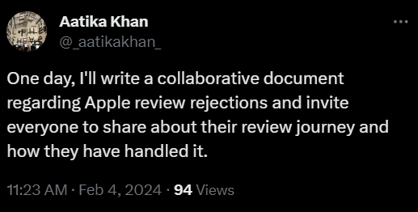

# AppleReviewRejections
A GitHub repository for all the developers to discuss/share whose apps were rejected by Apple and share about their review journey and how they have handled it.

Hi, This is a fun/silly github repo inspired by Aatika khan on twitter

 (https://x.com/_aatikakhan_/status/1754020242114904209?s=20) to share about Apple review rejections journey and how they have handled it.

If you want to share your journey/story, 

1. Fork this repository.

2. Create a markdown file with the name of your company.
   Exmaple if you company name is "Epic Games" name the file as Epicgames.md

3. Please give some introduction about you/your company and Write down your story about how you faced problem and how you solved it. 

4. Create a pull request.  
